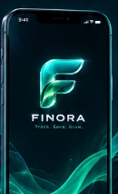
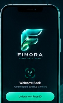
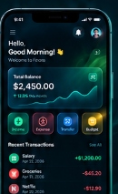

  

<h1 align="center">FINORA</h1>

  <b>Track. Save. Grow.</b> 
  <i>A simple, secure and beautifully designed personal finance app with biometric protection.</i>

  
  
  

 

  

  <b>Latest Android APK • Free Download</b>

  

 

  

---

## 📱 App Preview

  <table border="0">
    <tr>
      <td align="center" width="33%" valign="top">
        <h3>Splash Screen</h3>
        
<i>Minimal animated neon brand entry</i>

        
      </td>
      <td align="center" width="33%" valign="top">
        <h3>Biometric Lock</h3>
        
<i>Secure biometric & device unlock</i>

        
      </td>
      <td align="center" width="33%" valign="top">
        <h3>Home Screen</h3>
        
<i>Clean personal finance overview</i>

        
      </td>
    </tr>
  </table>

---

## ✨ Features

- 🔐 **Biometric Security** — Face ID, Touch ID, and Fingerprint authentication where supported by hardware.
- ⚡ **Quick Unlock & PIN Fallback** — Instant biometric access with a 6-digit PIN fallback and 60-second auto-lock.
- 💰 **Income & Expense Tracking** — Fast transaction logging with custom numeric keypad, category tagging, and date picker.
- 📊 **Real-Time Live Balance** — Auto-computed Total Balance, Total Income, and Total Expenses updated instantaneously.
- 🗄️ **Local SQLite Database** — 100% offline, zero-cloud data storage with full privacy and persistent local cache.
- 🗑️ **Swipe to Delete & History** — Effortlessly delete transactions with a swipe gesture and view the full transaction history.
- 💎 **Premium Dark Glass UI** — Cyberpunk dark glassmorphism interface styled with emerald and cyan neon accents.

---

## 📥 Download Finora

Ready to experience Finora? Grab the latest Android release package directly from GitHub Releases:

  

### Step-by-Step Installation:

1. Tap **[DOWNLOAD APK](https://github.com/raveenn10-bit/finora/releases/latest)** to open the latest release page.
2. In the **Assets** section at the bottom of the release, download the `Finora-v<VERSION>.apk` file (e.g., `Finora-v2.0.0.apk`).
3. Once the download finishes, open the downloaded APK on your Android device.
4. When prompted, permit your browser or file manager to **"Install apps from this source"**.
5. Tap **Install** and launch **Finora**.

---

## 🔒 Biometric Security & Privacy

Finora is designed privacy-first:

- **100% Local**: All financial records and categories are stored locally in your phone's SQLite database. No analytics, tracking, or cloud uploads.
- **Hardware-Isolated Auth**: Fingerprint and Face ID authentication run entirely through native Android BiometricPrompt security enclaves.

---

## 🛠 Built With

- **[Flutter](https://flutter.dev/)** (3.24.5) — Multi-platform UI framework
- **[Dart](https://dart.dev/)** — Modern client-optimized language
- **[Riverpod](https://riverpod.dev/)** — Reactive state management
- **[SQLite / sqflite](https://pub.dev/packages/sqflite)** — Fast, lightweight local database
- **[local_auth](https://pub.dev/packages/local_auth)** — Biometric authentication plugin
- **[flutter_secure_storage](https://pub.dev/packages/flutter_secure_storage)** — Encrypted PIN storage

---

## 📦 Release Information

- **Current Version**: `v2.0.0`
- **Repository**: [`raveenn10-bit/finora`](https://github.com/raveenn10-bit/finora)
- **Releases**: [View all releases on GitHub](https://github.com/raveenn10-bit/finora/releases)

---

  © 2026 Finora. Open Source personal finance application.

